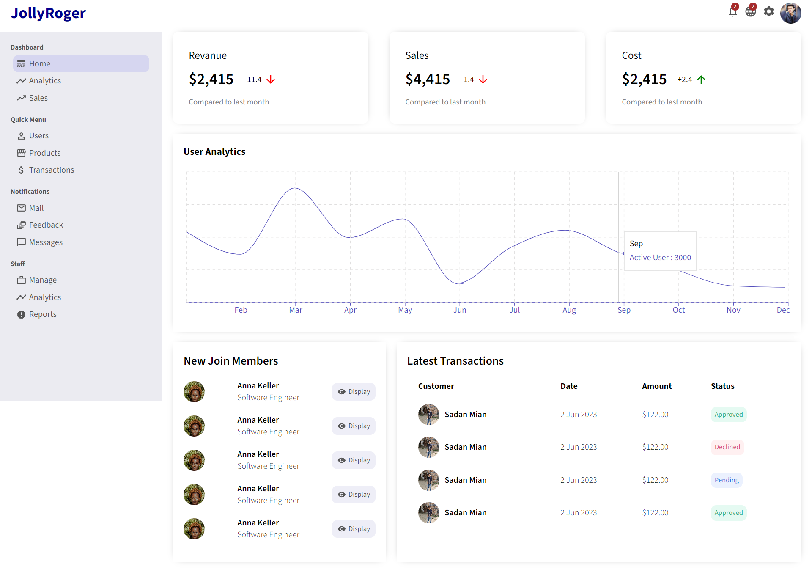

# Admin Dashboard



Welcome to the Admin Dashboard project! This repository contains a responsive admin dashboard built using React. It provides an interface for managing users and products, offering functionalities such as creating, editing, and deleting users and products.

To access the website, click on the [Home Page](https://sadanmian.github.io/Admin-Dashboard/) link.

## Features

- Responsive design that adapts to various screen sizes.
- User Page:
  - Create a new user.
  - Edit user details.
  - Delete a user.
- Product Page:
  - Create a new product.
  - Edit product details.
  - Delete a product.

## Usage

To use the Admin Dashboard, follow these steps:

1. Visit the [Home Page](https://sadanmian.github.io/Admin-Dashboard/).
2. Click on the navigation links to access the User Page or Product Page.
3. On the User Page:
   - Create a new user by clicking the "Create User" button.
     [Admin Dashboard](./public/createUser.png)
   - Edit user details by clicking the "Edit" button on a user card.
     [Admin Dashboard](./public/editUser.png)
   - Delete a user by clicking the "Delete" button on a user card.
     [Admin Dashboard](./public/user.png)
4. On the Product Page:
   - Create a new product by clicking the "Create Product" button.
     [Admin Dashboard](./public/createProduct.png)
   - Edit product details by clicking the "Edit" button on a product card.
     [Admin Dashboard](./public/editProduct.png)
   - Delete a product by clicking the "Delete" button on a product card.
     [Admin Dashboard](./public/product.png)

## Installation

To run the Admin Dashboard locally, follow these steps:

1. Clone the repository:

   ```bash
   git clone https://github.com/sadanmian/Admin-Dashboard.git
   ```

2. Navigate to the project directory:

   ```bash
   cd Admin-Dashboard
   ```

3. Install the dependencies:

   ```bash
   npm install
   ```

## Getting Started

1. After installing the dependencies, you can start the development server by running:

   ```bash
   npm start
   ```

   This will start the app in development mode. Open [http://localhost:3000](http://localhost:3000) to view it in the browser.

2. Navigate through the different pages using the navigation links and explore the functionalities.

## Folder Structure

The project's folder structure is organized as follows:

```
Admin-Dashboard/
├── public/
└── src/
    ├── assets/
    ├── components/
    ├── pages/
    ├── App.js
    ├── index.js
    └── ...
```

- `public/`: Contains static assets that are directly copied to the build folder.
- `src/assets/`: Includes images and other assets used in the project.
- `src/components/`: Contains reusable components used throughout the application.
- `src/pages/`: Contains the main pages of the application, such as User Page and Product Page.
- `App.js`: The main component that defines the application's structure.
- `index.js`: The entry point of the application.

## Contributing

Contributions are welcome! If you find any issues or want to enhance the project, feel free to create pull requests.
